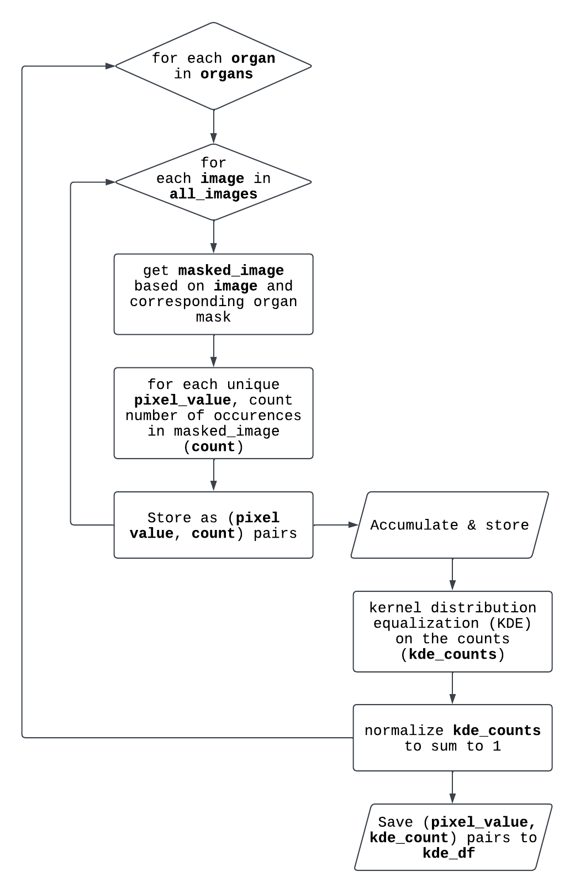
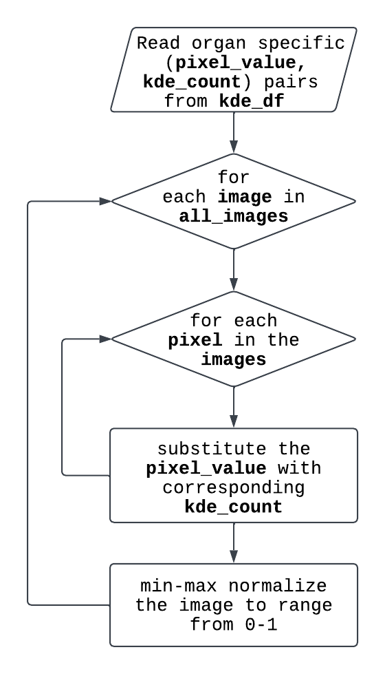
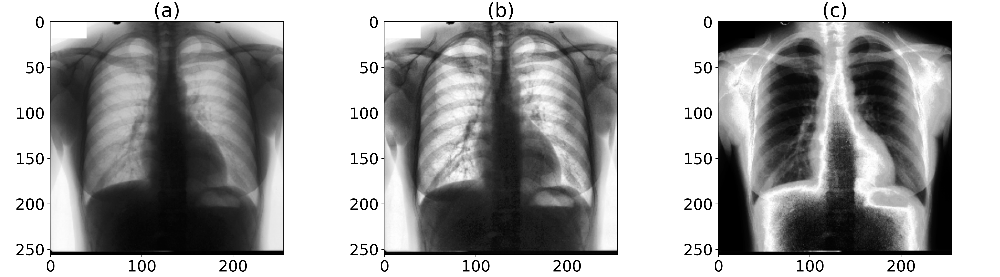

# ps-KDE
## Introduction
Pixel-wise Substitution by Kernel Density Estimation (ps-KDE) is a novel preprocessing technique designed to be used in combination with deep learning algorithms. In the context of chest radiographs, histograms of pixel values in different organs can be generated and then perform kernel density estimation (KDE) to get a probability density function (PDF) for each organ. The PDFs were calculated based on the training set and were stored as prior knowledge. For each image, substitute each pixel with the density of that pixel value. The image would then be mapped to a 0-1 range to ensure consistency among images. In other words, ps-KDE substitute pixel value for frequency, so that more frequently occurring pixel values in an organ would have a higher value in the resulting plot.

ps-KDE brings three notable contributions: 1) it presents an end-to-end data enhancement method characterized by its simplicity of implementation and adaptability for fine-tuning to accommodate diverse datasets; 2) it demonstrates the efficacy of a density-based augmentation method in segmenting vital organs in chest X-rays; and 3) it establishes the robustness of segmentation algorithms through the interpretation of heatmaps generated by the model.  

**The algorithm flowcharts**:

**ps-KDE examples**:

An example of an X-ray image being processed. (a) Original chest X-ray image. (b) CLAHE processed chest X-ray image. (c) ps-KDE processed chest X-ray image (location: heart). CLAHE: Contrast Limited Adaptive Histogram Equalization.

## How to use
`fcns.py` contains all of the helper functions to create the pixel table and to substitute values.

`ps_KDE.ipynb` contains a demonstration on ps-KDE.

Example images used in this repository is a subset of dataset provided by the Japanese Society of Radiological Technology (JSRT) Database (https://pubmed.ncbi.nlm.nih.gov/10628457/). Images are open-access.

## Citation
TBD